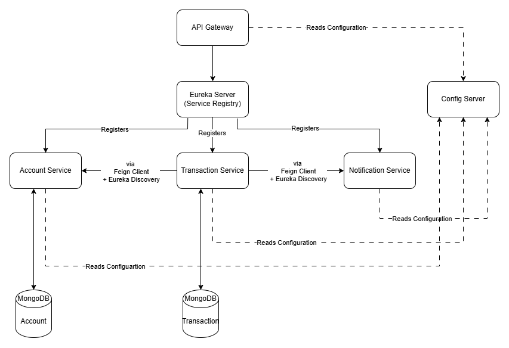

# Banking System Simulator (Microservices Architecture with Spring Boot + MongoDB)

## Overview 

A distributed banking platform implemented using **Spring Boot Microservices**, **Spring Cloud**, and **MongoDB**.  
This project refactors a monolithic banking system into fully independent microservices with service discovery, centralized configuration, an API gateway, and inter-service communication.

## Features

- Microservices-based architecture (Accounts, Transactions, Notifications)
- Service Discovery using **Eureka Server**
- API Gateway using **Spring Cloud Gateway**
- Centralized config with **Config Server**
- Inter-service communication using **Feign Client**
- Fault tolerance using **Resilience4j Circuit Breaker**
- MongoDB database per microservice
- Centralized logging (SLF4J + Logback)
- Docker support for each service

## Architecture Overview

### Microservices

| Service               | Description                                  | Database           |
|----------------------|----------------------------------------------|--------------------|
| **Account Service**   | Manages accounts & balances                  | `accounts_db`      |
| **Transaction Service** | Handles deposits, withdrawals, transfers    | `transactions_db`  |
| **Notification Service** | Sends logs/simulated email notifications    | —                  |
| **API Gateway**       | Routes external requests                     | —                  |
| **Eureka Server**     | Service discovery registry                   | —                  |
| **Config Server**     | Centralized configuration                    | —                  |

### Architecture Diagram

[]

## Microservices Breakdown

### 1. Account Service
Manages account creation and balance maintenance.

#### **Key Responsibilities**
- Create, update, fetch accounts
- Update balance after transactions via REST/Feign
- Activate/deactivate accounts

#### **REST Endpoints**

***Base URL (via API Gateway)*** : `/api/accounts`

##### Endpoints Overview

| Method   | Endpoint                                | Description               |
| -------- | --------------------------------------- | ------------------------- |
| **POST** | `/api/accounts`                         | Create a new account      |
| **GET**  | `/api/accounts/{accountNumber}`         | Fetch account details     |
| **PUT**  | `/api/accounts/{accountNumber}/balance` | Deposit or withdraw money |
| **PUT**  | `/api/accounts/{accountNumber}/status`  | Update account status     |

##### 1. **Create Account** : POST `/api/accounts`

Creates a new bank account.The system auto-generates the account number.

- ###### Request Body
```json
{
  "holderName": "John Doe"
}

```

- ###### Validation Rules
| Field        | Rules                            |
| ------------ | -------------------------------- |
| `holderName` | Required, alphabet + spaces only |

- ###### Successful Response `201 CREATED`
```json
{
  "id": "67a425dd91f1e45d7469d381",
  "accountNumber": "JOH1234",
  "holderName": "John Doe",
  "balance": 0.0,
  "status": "ACTIVE"
}
```
- ###### Possible Errors
| HTTP Code                   | Error            | When               |
| --------------------------- | ---------------- | ------------------ |
| `400 BAD REQUEST`           | Validation Error | Invalid holderName |
| `500 INTERNAL SERVER ERROR` | Database Error   | DB failure         |

##### 2. **Get Account Details** : GET `/api/accounts/{accountNumber}`

Fetch account details by account number.
- ###### Path Variable Validation
| Field           | Pattern                              |
| --------------- | ------------------------------------ |
| `accountNumber` | `^[A-Z]{3}\d{4}$` Example: `ABC1234` |


- ###### Successful Response `200 OK`
```json
{
  "id": "67a425dd91f1e45d7469d381",
  "accountNumber": "JOH1234",
  "holderName": "John Doe",
  "balance": 1200.0,
  "status": "ACTIVE"
}
```
- ###### Possible Errors
| HTTP Code                   | Error             | Reason                 |
| --------------------------- | ----------------- | ---------------------- |
| `404 NOT FOUND`             | Account Not Found | Invalid account number |
| `400 BAD REQUEST`           | Validation Error  | Wrong format           |
| `500 INTERNAL SERVER ERROR` | Database Error    | Mongo failure          |

##### 3. **Update Account Balance** : PUT `/api/accounts/{accountNumber}/balance`

Handles both deposit and withdrawal.

- ###### Request Body
```json
{
  "amount": 500,
  "updateType": "DEPOSIT"
}
```
or
```json
{
  "amount": 300,
  "updateType": "WITHDRAW"
}
```

- ###### Validation Rules
| Field        | Rules                   |
| ------------ | ----------------------- |
| `amount`     | Positive, non-zero      |
| `updateType` | `DEPOSIT` or `WITHDRAW` |

- ###### Successful Response `200 OK`
```json
{
  "id": "67a425dd91f1e45d7469d381",
  "accountNumber": "JOH1234",
  "holderName": "John Doe",
  "balance": 1700.0,
  "status": "ACTIVE"
}
```

- ###### Possible Errors

| HTTP Code                   | Error                | Reason                         |
| --------------------------- | -------------------- | ------------------------------ |
| `400 BAD REQUEST`           | Validation Error     | amount <= 0                    |
| `404 NOT FOUND`             | Account Not Found    | Wrong account number           |
| `423 LOCKED`                | Account Inactive     | Cannot update inactive account |
| `422 UNPROCESSABLE ENTITY`  | Insufficient Balance | Withdraw > balance             |
| `500 INTERNAL SERVER ERROR` | Database Error       | Save failure                   |

##### 4.  **Update Account Status** : PUT `/api/accounts/{accountNumber}/status`

Used for Activating or Deactivating an account.

- ###### Request Body
```json
{
  "status": "INACTIVE"
}
```
**Allowed Values**:
1. ACTIVE

2. INACTIVE

- ###### Successful Response `200 OK`
```json
{
  "id": "67a425dd91f1e45d7469d381",
  "accountNumber": "JOH1234",
  "holderName": "John Doe",
  "balance": 1700.0",
  "status": "INACTIVE"
}
```
- ###### Possible Errors
| HTTP Code                   | Error             | Reason                  |
| --------------------------- | ----------------- | ----------------------- |
| `409 CONFLICT`              | Same Status Error | Already ACTIVE/INACTIVE |
| `404 NOT FOUND`             | Account Not Found | Invalid account number  |
| `400 BAD REQUEST`           | Validation Error  | Missing status          |
| `500 INTERNAL SERVER ERROR` | Database Error    | Mongo failure           |


### 2. Transaction Service
Handles all banking transactions and communicates with Account & Notification services.

#### **Responsibilities**

- Deposit, Withdraw, Transfer

- Update account balances via REST/Feign

- Notify Notification Service on each transaction

#### **REST Endpoints**

***Base URL (via API Gateway)*** : `/api/accounts`

| Operation        | Method | Endpoint                                    |
| ---------------- | ------ | ------------------------------------------- |
| Deposit          | POST   | `/api/transactions/deposit`                 |
| Withdraw         | POST   | `/api/transactions/withdraw`                |
| Transfer         | POST   | `/api/transactions/transfer`                |
| Get Transactions | GET    | `/api/transactions/account/{accountNumber}` |

##### 1. **Deposit Funds** : POST `/api/transactions/deposit`

Adds money to an existing bank account.
This operation updates the account balance in the Account Service and then stores a transaction record.

- ###### Request Body
```json
{
  "accountNumber": "VIK6134",
  "amount": 5000
}
```
- ##### Validation Rules
| Field           | Type   | Required | Description                                           |
| --------------- | ------ | -------- | ----------------------------------------------------- |
| `accountNumber` | String | Yes      | Valid account number (3 uppercase letters + 4 digits) |
| `amount`        | Double | Yes      | Must be a positive, non-zero value                    |

- ###### Successful Response `201 CREATED`
```
{
    "id": "692bf120dad32a4956d49821",
    "transactionId": "TXN-20251130-003",
    "type": "DEPOSIT",
    "amount": 5000.0,
    "timestamp": "2025-11-30T07:24:16.074944153",
    "status": "SUCCESS",
    "accountNumber": "VIK6134"
}
```
- ###### Possible Errors
| HTTP Code | Error             | Meaning                                  |
| --------- | ----------------- | ---------------------------------------- |
| 404       | Account Not Found | Account does not exist                   |
| 423       | Account Inactive  | Deposit attempted on an inactive account |
| 500       | Database Error    | Mongo or service layer failure           |
| 400       | Validation Error  | Invalid request payload                  |


##### 2. **Withdraw Funds** : POST `/api/transactions/withdraw`
Deducts money from an account.
Checks account balance and status using the Account Service.

- ###### Request Body
```json
{
  "accountNumber": "VIK6134",
  "amount": 2000
}
```
- ##### Validation Rules
| Field           | Type   | Required | Description                                           |
| --------------- | ------ | -------- | ----------------------------------------------------- |
| `accountNumber` | String | Yes      | Valid account number (3 uppercase letters + 4 digits) |
| `amount`        | Double | Yes      | Must be a positive, non-zero value                    |


- ###### Successful Response `201 CREATED`
```json
{
    "id": "692c026ddad32a4956d49827",
    "transactionId": "TXN-20251130-869",
    "type": "WITHDRAW",
    "amount": 2000.0,
    "timestamp": "2025-11-30T08:38:05.286610727",
    "status": "SUCCESS",
    "accountNumber": "VIK6134"
}
```
- ###### Possible Errors
| HTTP Code | Error                | Meaning                                  |
| --------- | -------------------- | ---------------------------------------- |
| 404       | Account Not Found    | Account does not exist                   |
| 423       | Account Inactive     | Withdrawal attempted on inactive account |
| 422       | Insufficient Balance | Withdrawal > available balance           |
| 500       | Database Error       | Failed to save transaction               |
| 400       | Validation Error     | Invalid amount or account number         |

##### 3. **Transfer Funds** : POST `/api/transactions/transfer`
Transfers money from one account to another.

- ###### Request Body
```json
{
  "amount": 1000,
  "sourceAccount": "VIK6134",
  "destinationAccount": "ABH6784"
}
```
- ###### Validation Rules
| Field                      | Type   | Required | Description              |
| -------------------------- | ------ | -------- | ------------------------ |
| `sourceAccountNumber`      | String | Yes      | Must be valid and active |
| `destinationAccountNumber` | String | Yes      | Must be valid and active |
| `amount`                   | Double | Yes      | Must be positive         |

- ###### Successful Response `201 CREATED`
```json
{
    "id": "692bf13cdad32a4956d49824",
    "transactionId": "TXN-20251130-593",
    "type": "TRANSFER",
    "amount": 1000.0,
    "timestamp": "2025-11-30T07:24:44.593309085",
    "status": "SUCCESS",
    "sourceAccount": "VIK6134",
    "destinationAccount": "ABH6784"
}
```
- ###### Possible Errors
| HTTP Code | Error                | Meaning                              |
| --------- | -------------------- | ------------------------------------ |
| 404       | Account Not Found    | One or both accounts do not exist    |
| 423       | Account Inactive     | One or both accounts inactive        |
| 422       | Insufficient Balance | Source account balance too low       |
| 409       | Same Account Error   | Source and destination are identical |
| 500       | Database Error       | Transfer failed internally           |
| 400       | Validation Error     | Invalid input                        |

##### 4. **Get Transactions for an Account** : GET `/api/transactions/account/{accountNumber}`

Returns all transactions (deposit, withdraw, transfer) for a specific account.

- ###### Path Variable
| Variable        | Required | Validation                          |
| --------------- | -------- | ----------------------------------- |
| `accountNumber` | Yes      | Must match regex `^[A-Z]{3}\\d{4}$` |

- ###### Success Response `200 OK`
```json
[
    {
        "id": "692c026ddad32a4956d49827",
        "transactionId": "TXN-20251130-869",
        "type": "WITHDRAW",
        "amount": 1000.0,
        "timestamp": "2025-11-30T08:38:05.286",
        "status": "SUCCESS",
        "accountNumber": "VIK6134",
        "sourceAccount": null,
        "destinationAccount": null
    },
    {
        "id": "692c0269dad32a4956d49826",
        "transactionId": "TXN-20251130-968",
        "type": "DEPOSIT",
        "amount": 1000.0,
        "timestamp": "2025-11-30T08:38:01.417",
        "status": "SUCCESS",
        "accountNumber": "VIK6134",
        "sourceAccount": null,
        "destinationAccount": null
    },
    {
        "id": "692c0263dad32a4956d49825",
        "transactionId": "TXN-20251130-517",
        "type": "WITHDRAW",
        "amount": 1000.0,
        "timestamp": "2025-11-30T08:37:55.824",
        "status": "FAILED",
        "accountNumber": "VIK6134",
        "sourceAccount": null,
        "destinationAccount": null
    },
    {
        "id": "692bf13cdad32a4956d49824",
        "transactionId": "TXN-20251130-593",
        "type": "TRANSFER",
        "amount": 1000.0,
        "timestamp": "2025-11-30T07:24:44.593",
        "status": "SUCCESS",
        "accountNumber": null,
        "sourceAccount": "VIK6134",
        "destinationAccount": "ABH6784"
    }
]
```

- ###### Possible Errors
| HTTP Code | Error             | Meaning                       |
| --------- | ----------------- | ----------------------------- |
| 404       | Account Not Found | Account does not exist        |
| 400       | Validation Error  | Invalid account number format |
| 500       | Database Error    | Error reading transactions    |


### 3. Notification Service

Simulates log notifications for transactions.

#### **REST Endpoint**
| Operation         | Method | Endpoint                  |
| ----------------- | ------ | ------------------------- |
| Send Notification | POST   | `/api/notifications/send` |

##### 1. **Send Notification** : POST `/api/notifications/send`
Log notifications for transactions

- ###### Request Body
```json
{
    "message": "Testing from Postman"
}
```
- ###### Success Response `200 OK`
```json
Notification logged successfully
```

## Service Discovery & Gateway

- #### Eureka Server
All microservices register automatically to Eureka Server

- #### API Gateway Routes
| Route                   | Service              |
| ----------------------- | -------------------- |
| `/api/accounts/**`      | Account Service      |
| `/api/transactions/**`  | Transaction Service  |
| `/api/notifications/**` | Notification Service |


## Inter-Service Communication
1. **Transaction Service → Account Service**
- Update balances
- Validate accounts

2. **Transaction Service → Notification Service**

- Send notifications

3. **Fault Tolerance**

- Implemented using Resilience4j Circuit Breaker
- Ensures Transaction Service does not fail when dependencies are down

## Configuration

### Service Ports
| Service              | Port                           |
| -------------------- | ------------------------------ |
| Account Service      | 8081                           |
| Transaction Service  | 8082                           |
| Notification Service | 8083                           |
| API Gateway          | 8080                           |
| Eureka Server        | 8761                           |
| Config Server        | 8084                           |

## Logging

- Centralized logging using SLF4J + Logback
- Correlation IDs added to trace requests across microservices

## Testing
1. **Unit Testing**

- JUnit + Mockito for each microservice

2. **Integration Testing**

Test complete flow using Postman:
- Deposit
- Withdraw
- Transfer
- Notification Trigger

## Basic Setup Requirements

1. Java Development Kit (JDK 17+)
2. Apache Maven (3.8+)
3. Docker
4. Git (Required for Config Server)
5. MongoDB
6. IDE

## Project Structure
```bash
/Banking-System-Simulator
│
├── api-gateway
├── eureka-server
├── config-server
├── account-service
├── transaction-service
├── notification-service
├── docker-compose.yml
└── README.md
```

## How to Run the Banking System
This project supports two ways of running:

### 1. Running each Spring Boot service manually (without Docker)

#### 1. Start Eureka Server
```bash
cd eureka-server
mvn clean install
mvn spring-boot:run
```
Runs on: `http://localhost:8761`

#### 2. Start Config Server
```bash
cd config-server
mvn clean install
mvn spring-boot:run
```
Runs on: `http://localhost:8084`

#### 3. Start API Gateway
```bash
cd api-gateway
mvn clean install
mvn spring-boot:run
```
Runs on: `http://localhost:8080`

#### 4. Start Account Service
```bash
cd account-service
mvn clean install
mvn spring-boot:run
```
Runs on: `http://localhost:8081`

#### 5. Start Notification Service
```bash
cd notification-service
mvn clean install
mvn spring-boot:run
```
Runs on: `http://localhost:8083`

#### 6. Start Transaction Service
```bash
cd transaction-service
mvn clean install
mvn spring-boot:run
```
Runs on: `http://localhost:8082`

### 2. Running everything through Docker Compose
Each microservice needs its Docker image before using docker-compose.

Run these commands from the root of each service directory:

1. **Eureka Server**
```bash
cd eureka-server
mvn clean package -DskipTests
docker build -t eurekaserver:latest .
```

2. **Config Server**
```bash
cd config-server
mvn clean package -DskipTests
docker build -t configserver:latest .
```

3. **API Gateway**
```bash
cd api-gateway
mvn clean package -DskipTests
docker build -t apigateway:latest .
```

4. **Account Service**
```bash
cd account-service
mvn clean package -DskipTests
docker build -t accountservice:latest .
```

5. **Notification Service**
```bash
cd notification-service
mvn clean package -DskipTests
docker build -t notificationservice:latest .
```

6. Transaction Service
```basg
cd transaction-service
mvn clean package -DskipTests
docker build -t transactionservice:latest .
```

- **Running the Full System with Docker Compose**

Make sure all images above are built.

Then simply run:

```bash
docker-compose up --build
```
Or to run in background:
```bash
docker-compose up -d --build
```

**Stopping Containers**
```bash
docker-compose down
```
To remove volumes as well:
```
docker-compose down -v
```

#### Service URLs (Through API Gateway)
| Service              | Gateway URL                              |
| -------------------- | ---------------------------------------- |
| Account Service      | `http://localhost:8080/api/accounts`     |
| Transaction Service  | `http://localhost:8080/api/transactions` |
| Notification Service | `http://localhost:8080/api/notifications`             |
